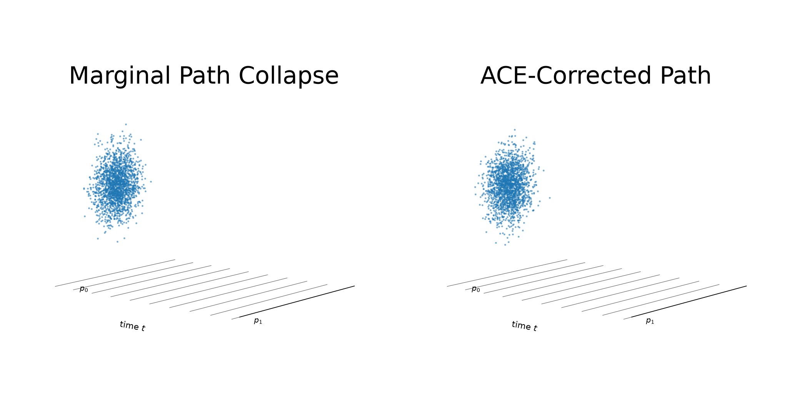
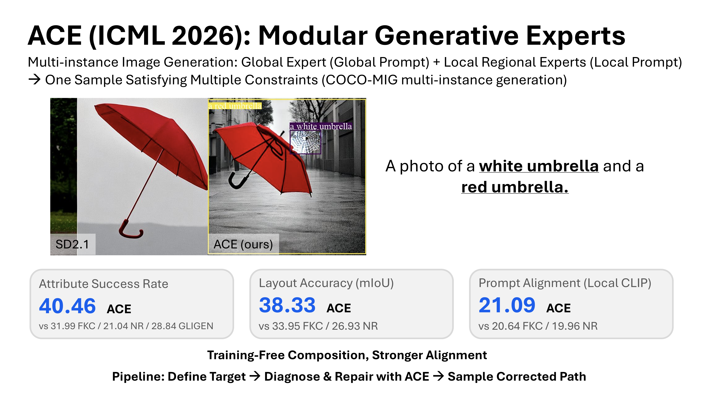
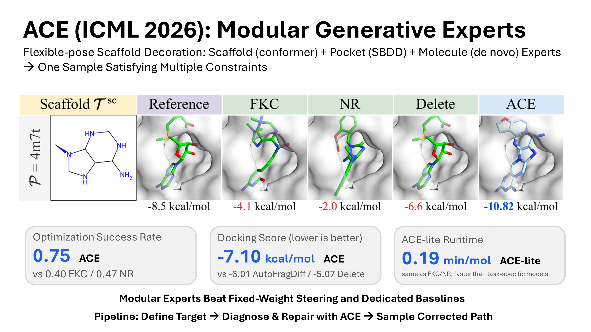

# [ICML 2026] On the Collapse of Generative Paths: A Criterion and Correction for Diffusion Steering

**Ziseok Lee, Minyeong Hwang, Wooyeol Lee, Sanghyun Jo, Jihyung Ko, Young Bin Park, Jae-Mun Choi, Eunho Yang, Kyungsu Kim**

[](https://arxiv.org/abs/2512.10339)
[](https://arxiv.org/pdf/2512.10339)
[](https://ziseoklee.github.io/projects/ACE/)
[](https://colab.research.google.com/github/ziseoklee/ACE/blob/main/2d_synthetic/ace_demo.ipynb)
[](https://github.com/ziseoklee/ACE/)



ACE diagnoses **Marginal Path Collapse** in ratio-of-densities diffusion steering and repairs the path with endpoint-preserving, time-varying exponents. The repository contains the code and configurations for the synthetic checker, flexible-pose scaffold-decoration, and compositional-image experiments in the paper.

## Results at a glance

| Compositional image generation | Flexible-pose scaffold decoration |
|---|---|
|  |  |

## Reproducing the paper

Each experiment is an independent uv project with its own `.venv`, `pyproject.toml`, and committed `uv.lock`. There is intentionally no repository-wide Python environment.

| Experiment | Paper correspondence | Reproduction guide |
|---|---|---|
| [`2d_synthetic/`](2d_synthetic/) | Synthetic checker benchmark, path criterion, and synthetic figures/tables | [`2d_synthetic/README.md`](2d_synthetic/README.md) |
| [`molecule/`](molecule/) | Flexible-pose scaffold decoration with EDM, GeoDiff, and DiffSBDD experts | [`molecule/README.md`](molecule/README.md) |
| [`image/`](image/) | Appendix E.4 and the Stable Diffusion rows of Table E.10 | [`image/README.md`](image/README.md) |

Install [uv](https://docs.astral.sh/uv/getting-started/installation/) and Git, clone the repository, and enter the experiment you want to run:

```bash
git clone https://github.com/ziseoklee/ACE.git
cd ACE
```

For the synthetic and image projects, create the local environment and install the exact locked dependencies with:

```bash
cd 2d_synthetic  # or: cd image
uv venv --python 3.11
uv sync --frozen
```

The molecule project also initializes pretrained-model submodules and downloads checkpoints, so use its setup script:

```bash
cd molecule
bash scripts/setup_project.sh
```

Run project commands through `uv run` to guarantee that they use the corresponding subdirectory's `.venv`. The detailed guides list hardware requirements, data and model downloads, exact paper settings, expected outputs, and lightweight validation commands. Full image and molecule reproduction requires an NVIDIA CUDA GPU and can require substantial compute and storage.

## Repository layout

```text
ACE/
├── 2d_synthetic/   # Synthetic checker training, evaluation, and notebook
├── image/          # Stable Diffusion COCO-MIG generation and evaluation
├── molecule/       # Flexible-pose scaffold-decoration inference/evaluation
├── figures/        # README result media
├── LICENSE
└── README.md
```

## Citation

If you find this code or paper useful, please cite:

```bibtex
@inproceedings{lee2026collapse,
  title     = {On the Collapse of Generative Paths: A Criterion and Correction for Diffusion Steering},
  author    = {Ziseok Lee and Minyeong Hwang and Wooyeol Lee and Sanghyun Jo and Jihyung Ko and Young Bin Park and Jae-Mun Choi and Eunho Yang and Kyungsu Kim},
  booktitle = {Forty-third International Conference on Machine Learning},
  year      = {2026},
  url       = {https://openreview.net/forum?id=emv2qsi3TG}
}
```

## License

This repository is released under the terms in [`LICENSE`](LICENSE). Pretrained models, datasets, and third-party submodules remain subject to their respective licenses and access conditions.
