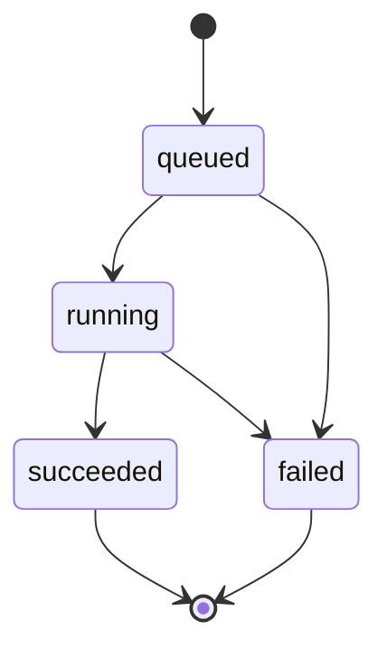

# ACE scaffold decoration web demo — API contract v1

- Created: 2026-09-25
- Status: **Capabilities, inference submission/execution, job status/results, and artifact endpoints are implemented. Evaluation submission remains a design specification for subsequent implementation.**
- Scope: Contracts for inputs, jobs, results, evaluation, and files between the FastAPI backend and the Svelte + TypeScript frontend
- API prefix: `/api/v1`

The frontend uses only the HTTP API. The backend manages model paths, GPU selection, Hydra configuration, and the server filesystem.
Inference and evaluation are separate jobs. Rerunning evaluation does not modify existing inference results.

## 1. Basic workflow

1. Call `GET /capabilities` to check available features and operational limits.
2. Submit an inference job by uploading a pocket, fragment, reference ligand, and generation settings.
3. Poll the returned job URL.
4. When the job completes, retrieve the results and download the generated SDF and input PDB/SDF files for visualization in the same coordinate frame.
5. Submit an evaluation job for selected generated samples, referencing them by job ID and sample ID.
6. Display the evaluation results and download the generated ligand SDF files.

Other clients may also upload their own ligands and use the evaluation API without running inference.

Unless otherwise specified, paths in the tables and request examples below have the `/api/v1` prefix.
IDs, timestamps, numbers, molecules, and scores in the JSON examples are **illustrative examples of the contract, not actual inference or evaluation results.**

## 2. Common rules

| Item                    | Contract                                                                                                           |
| ----------------------- | ------------------------------------------------------------------------------------------------------------------ |
| Response format         | `application/json`, UTF-8, except for file responses                                                               |
| Upload format           | `multipart/form-data`; `config` is a regular form field containing a UTF-8 JSON string                             |
| JSON fields             | `snake_case`. Unknown request fields are rejected, including those in nested objects                               |
| Types                   | No implicit type coercion, such as treating numeric strings or booleans as numbers                                 |
| Numbers                 | Only finite JSON numbers are allowed. `NaN` and infinity are prohibited                                            |
| Missing fields and null | Omitting a required field is an error. `null` is allowed only for fields explicitly identified below               |
| Timestamps              | UTC RFC 3339 strings, e.g. `2026-09-25T03:00:00Z`                                                                  |
| IDs                     | `job_id` and `artifact_id` are UUID strings issued by the server. `sample_id` is a zero-based integer within a job |
| URLs                    | Relative to the API origin. If the frontend and API have different origins, resolve URLs against the API origin    |
| Coordinates and units   | Molecular and pocket coordinates and distances: Å. Docking affinity: kcal/mol                                      |
| Request identification  | Every response includes `X-Request-ID`. Error responses include the same ID                                        |
| Caching                 | Job, result, and artifact responses use `Cache-Control: no-store` in the initial implementation                    |
| Versioning              | Incompatible changes to fields, units, states, or scientific meaning require a new API major version               |

Optional fields may be added to existing v1 responses. Clients may ignore unknown response fields,
but must not treat missing required fields or unknown status values as valid results.
New presets receive distinct IDs; the meaning of an existing preset must not change.

Filenames are for display. Clients cannot specify server input paths, output paths, checkpoint paths, commands,
or arbitrary Hydra overrides. Clients use the returned URLs rather than inferring the server's local directory structure.

## 3. Endpoints

| Method | Path                                     | Success response | Purpose                                               |
| ------ | ---------------------------------------- | ---------------- | ----------------------------------------------------- |
| GET    | `/capabilities`                          | `200`            | Feature availability, presets, and operational limits |
| POST   | `/inference/jobs`                        | `202`            | Submit an inference job                               |
| POST   | `/evaluation/jobs`                       | `202`            | Submit an evaluation job                              |
| GET    | `/jobs/{job_id}`                         | `200`            | Job status                                            |
| GET    | `/jobs/{job_id}/result`                  | `200`            | Structured results of a completed job                 |
| GET    | `/jobs/{job_id}/artifacts`               | `200`            | Files published by the job                            |
| GET    | `/jobs/{job_id}/artifacts/{artifact_id}` | `200`            | File for visualization or download                    |

The implementation also provides FastAPI's `/openapi.json` and `/docs`. These two paths do not use the `/api/v1` prefix.
OpenAPI must include descriptions and examples of the internal structure of the multipart `config` field.

The initial contract excludes job cancellation, deletion, listing/search, streaming, WebSocket, and batch CrossDocked benchmarks.
Accepted jobs continue even if the user closes the page or stops polling.

## 4. Capabilities and operational limits

`GET /capabilities` returns `200` while the API can respond. GPU unavailability is distinct from an API server failure.
The example below represents a response when all inference and evaluation prerequisites are met. Actual availability is determined in the execution worker's environment.

```json
{
  "api_version": "1.0.0",
  "inference": { "available": true, "reason": null },
  "evaluation": {
    "druglikeness": { "available": true, "reason": null },
    "scaffold_preservation": { "available": true, "reason": null },
    "docking": { "available": true, "reason": null }
  },
  "inference_presets": ["ace_scaffold_v1"],
  "limits": {
    "max_file_bytes": 10485760,
    "max_request_bytes": 33554432,
    "max_config_bytes": 16384,
    "max_pending_jobs": 4,
    "max_running_jobs": 1,
    "max_num_samples": 16,
    "max_num_sampling_steps": 2000,
    "max_num_ligand_atoms": 128,
    "max_pocket_atoms": 10000,
    "job_timeout_seconds": 3600
  }
}
```

- Feature status is `{available: boolean, reason: string | null}`. An available feature has `reason=null`; an unavailable feature requires a reason code.
  The initial reason codes are `cuda_unavailable`, `cuda_incompatible`, `checkpoint_missing`, `dependency_unavailable`, and `feature_not_enabled`.
- `available` means that the prerequisites for attempting the operation are met. It does not mean the model is already loaded on the GPU or guarantee successful execution.
- Druglikeness availability includes RDKit and the SA scorer. Docking availability includes the QuickVina executable and Open Babel CLI.
- The numbers above are **operational defaults for the initial deployment, not validated scientific limits of the models.** Server configuration may impose lower limits.
  Clients follow the limits in the actual response. Changing limits does not modify the settings of jobs that have already been accepted.
- The total request size includes multipart overhead. Per-file sizes and atom counts are checked separately.
  `max_num_ligand_atoms` also applies to atom counts after processing every ligand, fragment, and reference input.
  For evaluation ligands that cannot be sanitized, check the atom count immediately after parsing.
- The initial execution policy allows one running job and up to four queued jobs across inference and evaluation combined. New requests are rejected with `429` when the queue is full.
- Job timeouts start when execution begins and exclude time spent in the queue. Long-running execution is independent of the HTTP connection.
- For development with two origins, configure the allowed CORS origins on the server.
  Expose `Location`, `Retry-After`, `X-Request-ID`, and `Content-Disposition` so the browser can read them.

The current implementation checks prerequisites at server startup and returns those results for subsequent requests. Restart the server after changing its runtime environment or settings.
See [`backend/README.md`](../backend/README.md) for execution, configuration, and integration testing instructions.

## 5. Input files and scientific semantics

### 5.1 Inference inputs

| Form field             | Format      | Required | Meaning                                                                                                   |
| ---------------------- | ----------- | -------- | --------------------------------------------------------------------------------------------------------- |
| `pocket_pdb`           | PDB         | Yes      | A single protein model from which to select the pocket around the reference ligand                        |
| `fragment_sdf`         | SDF         | Yes      | A single molecule containing the scaffold graph and initial 3D coordinates                                |
| `reference_ligand_sdf` | SDF         | Yes      | Reference for pocket selection, automatic ligand atom count determination, and the subsequent docking box |
| `config`               | JSON string | Yes      | The `InferenceConfig` in §6                                                                               |

Store the original uploads separately from the normalized inputs actually used. All three structures must use Å units and the same protein coordinate frame.
The server does not automatically align uploads, generate conformers, or reconstruct missing atoms.
The fragment's initial position is used for visualization, but ACE performs flexible-pose decoration and does not fix the pose during generation.

Input processing rules:

1. A PDB may contain only one model. Check for finite coordinates and supported standard amino acid residues.
   Reject multiple models with `422` rather than arbitrarily selecting the first model.
2. An SDF must contain exactly one molecule record. Empty files, parsing failures, multiple records, and molecules with zero atoms return `422`.
3. Both inference SDFs must pass RDKit sanitization, contain a single connected component, and have a 3D conformer with finite coordinates.
   Do not create arbitrary 3D coordinates from 2D inputs.
4. After sanitization, apply the default RDKit `RemoveHs` policy to inference SDFs. Remove only removable explicit H atoms,
   preserving the order, coordinates, isotopes, and formal charges of retained atoms. Record this processing step and the RDKit version.
5. `num_ligand_atoms` is the reference molecule's `GetNumAtoms()` after this processing, or an explicitly specified model node count.
   It equals the heavy-atom count for typical heavy-atom inputs, but is not defined unconditionally as a heavy-atom count.
6. The GeoDiff-QM9 fragment vocabulary for `ace_scaffold_v1` is `H, C, N, O, F`.
   Reject a normalized fragment containing other elements or dummy/query atoms with `unsupported_fragment_atom`.
7. If `num_ligand_atoms=null`, use the normalized reference atom count.
   Both explicit and automatic values must be at least the fragment atom count and no greater than the actual server limit.
8. Reject inputs with `empty_pocket` if there are no usable pocket residues around the reference.
   Inputs in different coordinate frames cannot generally be detected with complete reliability; alignment is the caller's responsibility.

The existing DiffSBDD path does not simply use every atom in the supplied PDB.
It selects **standard amino acid residues containing an atom less than 8 Å from any atom of the reference ligand**.
Record this selection criterion and the identifiers of the residues actually selected in provenance. Provide the original PDB for visualization,
and include the selected pocket information in the results. The input PDB atom limit applies to the total atom count before selection.

The reference ligand is not treated as a generation ground truth or a topology to reproduce.
Current postprocessing does not forcibly restore the fragment topology in generated molecules,
so scaffold preservation must be determined through separate evaluation.

### 5.2 Evaluation uploads

- `ligand_sdf` also requires a single record, but sanitization failure for a parseable molecule may be reported as `validity=false` in druglikeness evaluation.
- Docking requires finite 3D ligand/reference coordinates and a pocket with a single model.
  Ligand 2D coordinates are allowed when evaluating only druglikeness or topology.
- Druglikeness is calculated after sanitizing a copy of the parsed molecule. Evaluation must not modify the original molecule or stored coordinates.
- The fragment used for topology comparison must be a sanitizable molecule with a single connected component.
  The GeoDiff-QM9 fragment element restriction does not apply to standalone evaluation without inference.
- The docking reference must be a sanitizable 3D molecule with a single connected component.
  Docking uses the input pocket as the receptor and does not automatically apply inference's 8 Å residue reselection rule.

File extensions and MIME types are format hints. Check the allowed extensions, `.pdb` and `.sdf`, and parse the actual content.
Do not reject an otherwise valid file solely because the browser supplies an empty MIME type or `application/octet-stream`.

## 6. Submitting inference jobs

`POST /inference/jobs`

Every field in `config` is required and must satisfy the ranges below. Only `num_ligand_atoms` permits `null`.
The request must explicitly include the UI's initial values. The server does not arbitrarily fill in omitted scientific settings.

| Field                 | Type and range                    | Initial UI value  | Existing code mapping                         |
| --------------------- | --------------------------------- | ----------------- | --------------------------------------------- |
| `preset`              | literal `ace_scaffold_v1`         | `ace_scaffold_v1` | Four-expert configuration in `inference.yaml` |
| `num_samples`         | integer, 1..server limit          | 5                 | `sampler.batch_size`                          |
| `seed`                | integer, 0..4294967295            | 42                | `sampler.seed`                                |
| `num_sampling_steps`  | integer, 10..server limit         | 500               | `sampler.num_sampling_steps`                  |
| `num_ligand_atoms`    | integer, 1..server limit, or null | null              | `data.num_ligand_atoms`                       |
| `ace.omega`           | finite number, 0..10              | 1.4               | `moe.omega`                                   |
| `ace.diffusion_scale` | finite number, 0 < x ≤ 10         | 2.0               | `moe.diffusion_scale`                         |
| `ace.b1`              | finite number, 0..100             | 30                | `moe.exponents.diffsbdd.weight_fn.B1`         |
| `ace.b2`              | finite number, 0..10              | 0.336             | `moe.exponents.diffsbdd.weight_fn.B2`         |

The upper limits and ACE parameter ranges define the demo's supported range. Reject out-of-range values rather than silently adjusting them.
`num_samples` is the **particle batch size of a single ACE run**, not the number of independent runs.
ACE resampling can introduce dependencies and duplicates among samples. Changing the batch size affects results even with the same seed.
`diffusion_scale=2.0` is an empirical value used for the current four-expert configuration.

`ace_scaffold_v1` fixes the following internal settings and records them in the full resolved config at execution time.

- sampler: `ACESampler`; global scheduler: `GEODIFF`.
- components: `EDM_GEOM_DRUG_FRAGMENT`, `EDM_GEOM_DRUG_LIGAND`, `GEODIFF_QM9_FRAGMENT`, `DIFFSBDD_CROSSDOCKED_FULLATOM_COND`.
- exponents, in the same order: `-omega`, `1-omega`, `omega`, `omega + b1*t*(1-t) + b2*t`.
- `use_logq=true`, `do_resample=true`, `dlogq_calc_interval=10`, `dlogq_noise_scale=3.16227766017`,
  `resampling_step_interval=10`, `ode_start_t=0.98`.
- The server selects and records the `device` and checkpoints. Future changes to internal defaults must not implicitly change this preset.

Example `InferenceConfig`:

```json
{
  "preset": "ace_scaffold_v1",
  "num_samples": 2,
  "seed": 42,
  "num_sampling_steps": 500,
  "num_ligand_atoms": null,
  "ace": {
    "omega": 1.4,
    "diffusion_scale": 2.0,
    "b1": 30.0,
    "b2": 0.336
  }
}
```

This config is provided in [`examples/inference-config.json`](../examples/inference-config.json). Submit a request from the project root as follows.
The command below submits a job to the running backend server.

```bash
curl --fail-with-body http://localhost:8000/api/v1/inference/jobs \
  -F 'pocket_pdb=@examples/4m7t_pocket.pdb' \
  -F 'fragment_sdf=@examples/4m7t_fragment.sdf' \
  -F 'reference_ligand_sdf=@examples/4m7t_ligand.sdf' \
  -F 'config=<examples/inference-config.json'
```

After parsing the files, performing basic chemical validation, and checking limits, the server stores the inputs and job metadata and returns `202 Accepted`.
It does not wait for model loading or sampling to complete. `202` does not indicate successful generation.
If submission fails, no job is created and temporary inputs are cleaned up.

```http
HTTP/1.1 202 Accepted
Location: /api/v1/jobs/3fdf520a-71f5-487d-b48a-156f5f030514
Retry-After: 2
Content-Type: application/json
```

```json
{
  "job_id": "3fdf520a-71f5-487d-b48a-156f5f030514",
  "kind": "inference",
  "status": "queued",
  "created_at": "2026-09-25T03:00:00Z",
  "updated_at": "2026-09-25T03:00:00Z",
  "links": {
    "self": "/api/v1/jobs/3fdf520a-71f5-487d-b48a-156f5f030514",
    "result": "/api/v1/jobs/3fdf520a-71f5-487d-b48a-156f5f030514/result",
    "artifacts": "/api/v1/jobs/3fdf520a-71f5-487d-b48a-156f5f030514/artifacts"
  }
}
```

Evaluation submissions use the same `202` contract, with `kind=evaluation`.
The initial API does not support idempotency keys. Repeating the same POST creates a new job.
The frontend must not automatically retry job submission solely because it did not receive a response.

## 7. Job states and lifecycle

Common fields: `job_id`, `kind` (`inference` or `evaluation`), `status`, `created_at`, `updated_at`, and `links`.
In every state, `links` contains the three URLs shown in the example in §6.
State-specific fields must be present as defined below. Do not include fields exclusive to other states.

| status      | Additional required fields                                                       | Meaning                                                        |
| ----------- | -------------------------------------------------------------------------------- | -------------------------------------------------------------- |
| `queued`    | None                                                                             | Accepted and waiting for execution                             |
| `running`   | `started_at`, `phase`, `progress`                                                | Execution in progress                                          |
| `succeeded` | `started_at`, `finished_at`                                                      | Execution complete, including publication of results and files |
| `failed`    | `started_at` (null if failure occurred before execution), `finished_at`, `error` | Entire job failed                                              |

Allowed transitions:



- Inference phases: `loading_models`, `sampling`, `postprocessing`, `writing_results`.
- Evaluation phases: `evaluating`, `writing_results`.
- `progress` is `null` or `{completed: integer, total: integer, unit: "sampling_step" | "sample"}`.
  `0 ≤ completed ≤ total`, `total > 0`. Report only the work actually measured for the current phase.
  Do not present sampling progress as overall job completion or fabricate percentages from elapsed time.
- The frontend polls every two seconds by default. For `queued`/`running` responses, the server returns `Retry-After` in seconds.
  Stop polling when a final state is reached. Distinguish transient network errors from job failures.
- Even when a job is `succeeded`, some or all generated samples may be invalid, or individual evaluations may fail. Check each result's status.
- GPU OOM, timeout, model loading failure, and failure to write required files make the job `failed`. Use the error object from §11 for `error`.
- Persist inputs, job metadata, and completed results rather than keeping them only in process memory.
  Completed jobs must remain retrievable after a restart. In the initial implementation, interrupted `queued`/`running` jobs
  are marked failed with `service_restarted` and are not automatically rerun.
- There is no automatic expiration initially. Jobs explicitly removed by an operator return `404`.
  On acceptance, an evaluation job preserves the required source job files and provenance in its own storage so that later cleanup of the source does not affect it.
- Final states and published artifact contents are immutable. A rerun receives a new job ID.

`GET /jobs/{id}/result` returns `200` only for `succeeded` jobs.
It returns `409 result_not_ready` if the job has not finished, and `409 job_failed` if the job failed.
A nonexistent job returns `404 job_not_found`. Do not return partial results as completed results.

## 8. Inference results

Required fields:

| Field                       | Type and meaning                                                                                                         |
| --------------------------- | ------------------------------------------------------------------------------------------------------------------------ |
| `job_id`, `kind`            | Job ID and the literal `inference`                                                                                       |
| `resolved_num_ligand_atoms` | Total ligand node count actually used                                                                                    |
| `summary`                   | Integers `{requested, available, invalid}`. `requested = available + invalid`                                            |
| `pocket_selection`          | `{cutoff_angstrom: 8.0, residues: ResidueId[]}`                                                                          |
| `inputs`                    | An ArtifactRef for each of `pocket_pdb`, `fragment_sdf`, and `reference_ligand_sdf`: the normalized inputs actually used |
| `samples`                   | A Sample array with the requested length, sorted by ascending `sample_id`                                                |
| `warnings`                  | `{code: string, message: string}[]`; an empty array if there are no warnings                                             |

`ResidueId` is `{chain_id: string, residue_number: integer, insertion_code: string}`.
Represent missing chain IDs or insertion codes as empty strings. No separate model index is exposed because only a single protein model is allowed.

`Sample` is one of the following two variants. Do not omit failed samples or renumber valid sample IDs.

- `available`: Requires `sample_id`, `status`, `atom_count`, `smiles`, `component_count`, `sdf`, and `preview_png`.
  `sdf` is an ArtifactRef; `preview_png` is an ArtifactRef or null.
  Only generated molecules that pass RDKit sanitization, finite 3D coordinate validation, and SDF serialization/read-back checks receive this status.
  SMILES is the canonical isomeric SMILES of the sanitized generated molecule.
- `invalid`: Requires `sample_id`, `status`, and `error`. Do not create SDF, SMILES, or score fields.
  Molecule reconstruction, sanitization, or coordinate validation failures receive this status. Do not substitute a valid molecule with a score of zero.

`atom_count` is the actual atom count in the returned SDF. A disconnected generated molecule may still be
`available` if it can be chemically parsed and sanitized, so `component_count` is provided separately. `available` does not guarantee scaffold preservation or biological efficacy.
Use `removeHs=False` for generated SDF serialization checks and loading for subsequent evaluation, preserving the generated atoms and coordinates.
A storage error that prevents writing a valid molecule's required SDF to disk fails the entire job rather than marking the sample invalid.
If optional PNG generation fails, return `preview_png=null` and a warning while retaining the SDF.

Example Sample array:

```json
[
  {
    "sample_id": 0,
    "status": "available",
    "atom_count": 27,
    "smiles": "CCCCCCCCCCCCCCCCCCCCCCCCCCC",
    "component_count": 1,
    "sdf": {
      "artifact_id": "865cdf3e-4471-46dd-b65f-e362d7ae439b",
      "url": "/api/v1/jobs/3fdf520a-71f5-487d-b48a-156f5f030514/artifacts/865cdf3e-4471-46dd-b65f-e362d7ae439b"
    },
    "preview_png": null
  },
  {
    "sample_id": 1,
    "status": "invalid",
    "error": {
      "code": "molecule_reconstruction_failed",
      "message": "The sampled coordinates could not be converted to a valid molecule.",
      "details": []
    }
  }
]
```

The `summary` for the example above is `{requested: 2, available: 1, invalid: 1}`.
Even if every sample is invalid, the job is `succeeded` if sampling, postprocessing, and result storage completed normally,
and a `no_valid_samples` warning is returned. Generated SDF files preserve the final ACE coordinates without arbitrary alignment or redocking.
Verifying that coordinates have been restored to the input pocket's coordinate frame is a required part of integration validation with actual inference.

## 9. Submitting evaluation jobs

`POST /evaluation/jobs`, `multipart/form-data`.
As with inference, `config` is a JSON string.

Required `EvaluationConfig` fields:

| Field     | Contract                                                                                              |
| --------- | ----------------------------------------------------------------------------------------------------- |
| `source`  | One of the two variants below                                                                         |
| `metrics` | A nonempty array of unique entries chosen from `druglikeness`, `scaffold_preservation`, and `docking` |
| `docking` | `DockingConfig` if docking is requested; otherwise, must be null                                      |

### 9.1 Referencing generated results

```json
{
  "source": {
    "type": "inference_job",
    "job_id": "3fdf520a-71f5-487d-b48a-156f5f030514",
    "sample_ids": [0]
  },
  "metrics": ["druglikeness", "scaffold_preservation", "docking"],
  "docking": {
    "seed": 42,
    "exhaustiveness": 8,
    "num_modes": 9,
    "padding_angstrom": 8.0
  }
}
```

- Do not send file parts. The server retrieves the ligand, pocket, fragment, and reference from the source job.
- `sample_ids` must be nonempty, contain no duplicates, and refer only to `available` samples.
  Results are returned in ascending sample ID order, regardless of request order.
- A nonexistent source job returns `404`; an unfinished or failed source job returns `409`; a job of another kind or an invalid sample ID returns `422`.
- Reject the entire request if any selection is invalid. Do not silently exclude selected samples.
- Do not implicitly reuse the original inference seed as the docking seed.

### 9.2 Standalone ligand uploads

```json
{
  "source": { "type": "upload" },
  "metrics": ["druglikeness"],
  "docking": null
}
```

| File part              | When required                                                      |
| ---------------------- | ------------------------------------------------------------------ |
| `ligand_sdf`           | Always required. A single ligand, with `sample_id=0` in the result |
| `fragment_sdf`         | Required when `scaffold_preservation` is requested                 |
| `pocket_pdb`           | Required when `docking` is requested                               |
| `reference_ligand_sdf` | Required when `docking` is requested                               |

Reject unnecessary file parts, duplicate parts, and unknown parts with `422`.
A docking reference is explicitly required. This API does not use the existing CLI's fallback that defines the box from the generated ligand.

All fields in `DockingConfig` are required.

| Field              | Type and range            | Initial UI value |
| ------------------ | ------------------------- | ---------------- |
| `seed`             | integer, 0..2147483647    | 42               |
| `exhaustiveness`   | integer, 1..32            | 8                |
| `num_modes`        | integer, 1..20            | 9                |
| `padding_angstrom` | finite number, 0 < x ≤ 20 | 8.0              |

The box center is the center of the reference coordinate bounding box.
The box length along each axis is `max(reference_extent + 2 * padding_angstrom, 10 Å)`.
Record the current Open Babel pH 7.4 receptor preparation policy and the actual box center and dimensions in provenance.
Each external QuickVina invocation uses the existing backend's 60-second timeout. The overall job timeout in §4 applies separately.

## 10. Evaluation results and metric semantics

The required evaluation result fields for `GET /jobs/{id}/result` are `job_id`, `kind` (`evaluation`), `source`, `metrics`, `samples`, and `warnings`.
`source` and `metrics` reflect the validated request. For each selected sample, `samples` contains
`{sample_id: integer, metrics: MetricGroups}`.
`MetricGroups` contains only the requested groups. `warnings` is an array of `{code, message}` objects, as in inference results.

Each measurement, `Report<T>`, is one of the following variants.

| status      | Additional required fields   | Meaning                                                            |
| ----------- | ---------------------------- | ------------------------------------------------------------------ |
| `succeeded` | `value: T`                   | An actually computed finite value, boolean, or object              |
| `failed`    | `error: Error`               | Calculation or docking failed. No `value`                          |
| `skipped`   | `reason: "invalid_molecule"` | Not computed because the ligand could not be sanitized. No `value` |

Do not replace failures with `0`, `false`, or an empty SMILES.
For example, an actual QED of 0 is `succeeded/value=0`, while a calculation failure is `failed`.

| Group / field                  | Type and meaning                                                                                                 |
| ------------------------------ | ---------------------------------------------------------------------------------------------------------------- |
| `druglikeness.validity`        | `Report<boolean>`; whether RDKit sanitization succeeded, independently of docking/scaffold success               |
| `druglikeness.qed`             | `Report<number>`; QED, 0..1                                                                                      |
| `druglikeness.sa_normalized`   | `Report<number>`; `clamp((10 - raw_sa) / 9, 0, 1)`. Higher values indicate easier synthesis                      |
| `druglikeness.logp`            | `Report<number>`; RDKit Crippen LogP                                                                             |
| `druglikeness.lipinski_legacy` | `Report<number>`; `(5 - violations) / 5` from the existing code                                                  |
| `scaffold_preservation`        | `Report<{contains_fragment: boolean, method: "rdkit_substructure_v1"}>`                                          |
| `docking`                      | `Report<{affinity_kcal_mol: number, num_poses: integer}>`; the lowest QuickVina affinity and the number of poses |

Additional semantics:

- An invalid ligand's `validity` is **a successfully measured false**. Its other druglikeness, topology, and docking values are `skipped`.
  Check whether the ligand can be sanitized before computing other metrics, even if `druglikeness` was not requested.
- `lipinski_legacy` counts violations of four conditions: MW ≤ 500, LogP ≤ 5, HBD ≤ 5, and HBA ≤ 10.
  As in the existing implementation, the denominator is 5, so the range is 0.2..1. Do not display it as a standard count of passed criteria or a boolean pass result.
  If the required LogP calculation fails, do not produce a legacy score without an actual LogP value.
- `rdkit_substructure_v1` sanitizes both molecules, applies `RemoveHs`, and then
  evaluates the ligand's `HasSubstructMatch(fragment, useChirality=False)`.
  This version follows RDKit's atom/bond/aromaticity matching semantics and does not compare stereochemistry.
  It indicates whether the input scaffold's topology **exists anywhere in the ligand**,
  not original atom index correspondence, pose preservation, RMSD, or binding affinity preservation. Do not restore topology for the comparison.
- The docking score is obtained by redocking, not by directly scoring the original generated pose.
  Do not overwrite the original generated SDF with the docked pose. Providing docked pose files is not required in v1.
- An evaluation job marked `succeeded` has recorded reports for every requested sample.
  Individual metric failures preserve other results. If every requested metric is failed/skipped, provide a `no_evaluation_values` warning.
  Problems that prevent completing the result itself, such as storage errors or job timeouts, make the job `failed`.

Example MetricGroups:

```json
{
  "druglikeness": {
    "validity": { "status": "succeeded", "value": true },
    "qed": { "status": "succeeded", "value": 0.61 },
    "sa_normalized": { "status": "succeeded", "value": 0.72 },
    "logp": { "status": "succeeded", "value": 2.8 },
    "lipinski_legacy": { "status": "succeeded", "value": 1.0 }
  },
  "scaffold_preservation": {
    "status": "succeeded",
    "value": { "contains_fragment": true, "method": "rdkit_substructure_v1" }
  },
  "docking": {
    "status": "failed",
    "error": {
      "code": "docking_failed",
      "message": "QuickVina returned no valid pose.",
      "details": []
    }
  }
}
```

**Differences from the current code:** `evaluate_druglikeness` replaces calculation failures with 0,
and `evaluate_docking` returns an affinity of 0 on failure. The returned numbers alone cannot distinguish a failure from an actual zero.
The subsequent evaluation API implementation must introduce a computation boundary that preserves failure causes.
Connect it to structured reports for the API without silently changing the existing CLI's semantics.
The `scaffold_preservation` metric defined above also requires subsequent implementation; it is not currently connected.

## 11. Error contract

HTTP error bodies use the following structure. The inner `error` object uses the same `Error` type for job and metric failures.

```json
{
  "request_id": "e49cbda4-58ec-4722-9464-b6ffbbec1b19",
  "error": {
    "code": "validation_error",
    "message": "The ligand atom count is smaller than the fragment atom count.",
    "details": [
      {
        "field": "config.num_ligand_atoms",
        "code": "atom_count_too_small",
        "message": "Expected at least 11 atoms."
      }
    ]
  }
}
```

`Error = {code: string, message: string, details: ErrorDetail[]}`.
`ErrorDetail = {field: string, code: string, message: string}`. The field value identifies a form field or a dot-separated JSON path.
Errors without field-level details use `details=[]`. User-facing messages must not include server stack traces or absolute server paths.
The frontend branches on stable `code` values rather than parsing messages. Normalize FastAPI's default validation errors to this format as well.

| HTTP  | Representative codes                                         | Situation                                                                                                             |
| ----- | ------------------------------------------------------------ | --------------------------------------------------------------------------------------------------------------------- |
| `400` | `malformed_request`                                          | Malformed multipart data or invalid JSON syntax                                                                       |
| `404` | `job_not_found`, `artifact_not_found`                        | A nonexistent job or an artifact that does not belong to that job                                                     |
| `409` | `result_not_ready`, `job_failed`, `source_job_not_succeeded` | An operation unavailable in the current job state                                                                     |
| `413` | `payload_too_large`                                          | Total request, file, or config byte limit exceeded                                                                    |
| `415` | `unsupported_media_type`                                     | A submission that is not multipart or has an unsupported file extension                                               |
| `422` | `validation_error`                                           | Missing required parts/fields, duplicate or unknown fields, or invalid ranges, file contents, or molecular conditions |
| `429` | `queue_full`                                                 | Queue capacity exceeded. Includes `Retry-After` in seconds                                                            |
| `503` | `inference_unavailable`, `evaluation_unavailable`            | Required prerequisites such as GPU, checkpoints, or evaluation tools are not met                                      |
| `500` | `internal_error`                                             | An unexpected server error during submission or retrieval                                                             |

Detail codes for chemical input validation include `invalid_structure`, `multiple_records`, `multiple_models`,
`coordinates_required`, `unsupported_fragment_atom`, `atom_count_too_small`, `limit_exceeded`, and `empty_pocket`.
If a submission includes even one unavailable metric, reject the entire request with `503` before acceptance.

A model error in a job already accepted with `202` does not change a subsequent GET response itself to `500`.
Status retrieval returns `200` with `status=failed` in the body.
Job error codes: `model_load_failed`, `inference_failed`, `evaluation_failed`, `gpu_out_of_memory`,
`job_timeout`, `artifact_write_failed`, `service_restarted`.
Sample/metric error codes: `molecule_reconstruction_failed`, `invalid_generated_molecule`,
`metric_unavailable`, `metric_failed`, `docking_failed`, `docking_timeout`.
New detailed error codes may be added, so clients must display unknown codes as generic errors.

## 12. Files, visualization, and reproducibility

`ArtifactRef = {artifact_id: UUID, url: string}`.
`GET /jobs/{job_id}/artifacts` returns `{job_id: UUID, artifacts: Artifact[]}`.
Each `Artifact` requires the following fields.

| Field                | Meaning                                                                                                                            |
| -------------------- | ---------------------------------------------------------------------------------------------------------------------------------- |
| `artifact_id`, `url` | File ID and access URL                                                                                                             |
| `role`               | `input_original`, `input_prepared`, `ligand`, `preview`, `request_config`, `resolved_config`, `provenance`, `result`, `diagnostic` |
| `filename`           | A safe filename for display and saving                                                                                             |
| `media_type`         | MIME type for the file formats below                                                                                               |
| `size_bytes`         | Actual file size in bytes                                                                                                          |
| `sha256`             | SHA-256 of the file contents, as 64 lowercase hexadecimal characters                                                               |

- PDB: `chemical/x-pdb`; SDF: `chemical/x-mdl-sdfile`; PNG: `image/png`;
  JSON: `application/json`; YAML: `application/yaml`; XYZ and other text diagnostics: `text/plain`.
- File GET responses default to `Content-Disposition: inline`. With `?download=true`, return `attachment` and a safe filename.
  The 3D viewer reads content and the download button saves files through the same URL.
- Publish files in the manifest only after they have been fully written. Inputs and settings already published can be retrieved while the job is still running.
  Every `ArtifactRef` in a successful result must exist in the manifest and be immediately downloadable.
- The manifest lists only published files. Do not create SDF links for failed samples.
  XYZ files, diagnostic outputs, and PNG files are optional; clients must not assume they exist.
- The frontend uses `inputs` and each sample's SDF to display the pocket, fragment, reference, and generated ligand distinctly.
  The pocket residues actually used can be identified through `pocket_selection`.
  Viewer styles and camera controls must not alter the original coordinates available for download.

For completed jobs, store the following reproducibility materials and make them available through the manifest.

1. Original uploads and the normalized inputs actually used, with a hash for each. Evaluations referencing a source job must also preserve the required inputs.
2. The request JSON and the full resolved config actually executed, including the automatically determined atom count, preset, seed, and all internal sampler settings.
3. Code version/commit, submodule revisions, whether the working tree was modified, and a diff sufficient to reconstruct it or a source snapshot identifier.
4. Checkpoint identifiers and SHA-256 hashes; versions of dependencies used, such as Python, PyTorch, RDKit, Open Babel, and QuickVina;
   and the actual device and CUDA information. For inference, separately record the GPU name and compute capability, the worker's `CUDA_DEVICE_ORDER` and `CUDA_VISIBLE_DEVICES`,
   the actual `sampler.device`, NVIDIA driver version, PyTorch version, and `torch.version.cuda`.
   Dependencies irrelevant to an evaluation job may be omitted.
5. Start and finish times, normalization policy, actual pocket selection, actual docking box, pH, settings, and execution results.
6. Result JSON and generated SDF files that preserve per-sample and per-evaluation successes and failures.

Make the settings and environment traceable without promising byte-for-byte reproducibility for CUDA, Open Babel, or docking.
Do not include secret environment variables or absolute server paths unnecessary for disclosure in provenance.
Subsequent evaluations produce provenance and results under separate jobs and do not overwrite the original inference files.

## 13. Existing code integration points and subsequent validation

| API responsibility                       | Code to reuse / implementation considerations                                                                                                                                      |
| ---------------------------------------- | ---------------------------------------------------------------------------------------------------------------------------------------------------------------------------------- |
| Four-expert configuration and parameters | [`src/configs/inference.yaml`](../src/configs/inference.yaml), [`config_sampler.py`](../src/configs/config_sampler.py), [`config_weight.py`](../src/configs/config_weight.py)      |
| Model runtime                            | [`src/inference/sampling_runtime.py`](../src/inference/sampling_runtime.py)                                                                                                        |
| Sampling per condition                   | `SamplingCondition`, `sample_condition`, and `write_sampling_result` in [`src/inference/condition_sampling.py`](../src/inference/condition_sampling.py)                            |
| Reference-based pocket selection         | [`src/experts/diffsbdd_expert.py`](../src/experts/diffsbdd_expert.py), and `get_pocket_from_ligand` in the pinned DiffSBDD version                                                 |
| Molecule reconstruction                  | [`src/postprocessing/molecule_builder.py`](../src/postprocessing/molecule_builder.py); the API must verify sanitization and serialization results and preserve per-sample failures |
| Druglikeness evaluation                  | [`src/evaluation/metrics/druglikeness.py`](../src/evaluation/metrics/druglikeness.py); a boundary is needed to distinguish zero fallbacks from calculation failures                |
| Docking evaluation                       | [`src/evaluation/metrics/docking.py`](../src/evaluation/metrics/docking.py), [`backends/qvina.py`](../src/evaluation/backends/qvina.py)                                            |
| Example inputs                           | `4m7t`, `3nfb`, and `4yhj` in [`examples/README.md`](../examples/README.md)                                                                                                        |

Contract validation criteria for subsequent implementation:

- Connect the full sequence using the three example inputs: submission → `202` → status retrieval → results → SDF reading and download.
- The UI can evaluate generated samples by sample ID without reuploading the same files. Standalone upload evaluation also works.
- Reject missing or malformed JSON, multiple SDF records/PDB models, nonfinite coordinates, unsupported fragment elements, and atom count/byte limit violations.
- Report queue saturation, GPU unavailability, job timeouts, and post-restart states according to the contract.
- Report inference readiness only after CUDA operation checks pass in the actual worker environment. Distinguish blocked GPU access from CUDA kernel compatibility failures,
  and preserve CPU evaluation availability reporting and the `200` response from `GET /capabilities` even when the GPU is unavailable.
- Distinguish some/all generated samples being invalid, topology not being preserved, and SA/docking failures from actual scores of zero.
- All referenced files exist, and their hashes, coordinates, and sample IDs agree with the results. Verify that generated coordinates use the pocket's coordinate frame.
- Executions are traceable through original inputs, resolved config, seed, and model/environment versions.
- Record API integration test results using substituted models separately from validation results for actual CUDA inference.

Capabilities, inference submission/execution, job status/results, and file APIs have integration tests. Evaluation submission and the frontend will be implemented in subsequent stages.
